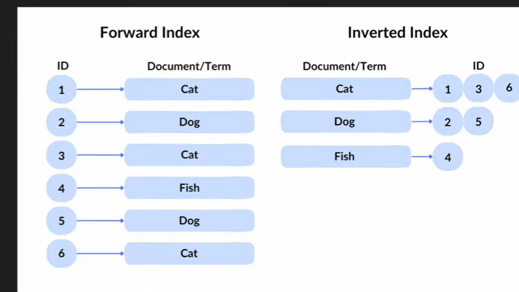

implement a simple search engine 
understand the working of search engine
also shows search history 
frontend = client side 
backend = server side 

#################################################################################################################

why real search engines dont read every file  ?

#################################################################################################################

x terms 
y documents 
z words 
then total time complexity would be O(x*y*z) for every search query 

Therefore we use inverted indexs

inverted index time complexity becomes O(x*z) number of docs the word is present in

using inverted index
['01_introduction.txt', '02_collections_documents.txt', '03_crud_operations.txt', '04_indexing.txt', '05_aggregation.txt', '06_data_modeling.txt', '07_replication.txt', '08_sharding.txt', '09_security.txt', '10_backup_monitoring.txt']
0.0012069999938830733
['06_data_modeling.txt', '09_security.txt', '10_backup_monitoring.txt', '02_collections_documents.txt', '04_indexing.txt', '03_crud_operations.txt', '08_sharding.txt', '05_aggregation.txt', '07_replication.txt', '01_introduction.txt']
7.700000423938036e-06

it is clearly seen now that the code now doesnt need to check for every word in every document and now uses inverted indexes that is each word is now already mapped to its corrosponding document and is then checked accordingly 

####################################################################################################################

Search Engine finds result but they are stupid 

####################################################################################################################

understanding the ranking system was quite easy we just need the number of time the particular word was in the document and we rank them accordingly as of now 

####################################################################################################################

Working on snippets 

Added the snippets functionality basically after the word is found at any index our logci seached for a corrosponding start and end of its index giving us the answers 

####################################################################################################################

Folder Structure 

Bindal-OS/
├── main.py
├── client/
│   ├── __init__.py
│   └── app.py
├── server/
│   ├── __init__.py
│   ├── file_loader.py
│   └── search_engine/
│       ├── __init__.py
│       ├── tokenizer.py
│       ├── indexing.py
│       ├── search.py
│       ├── snippets.py
│       └── benchmark.py
└── data/

Now the code has an expandable and scalable folder structure 

####################################################################################################################

